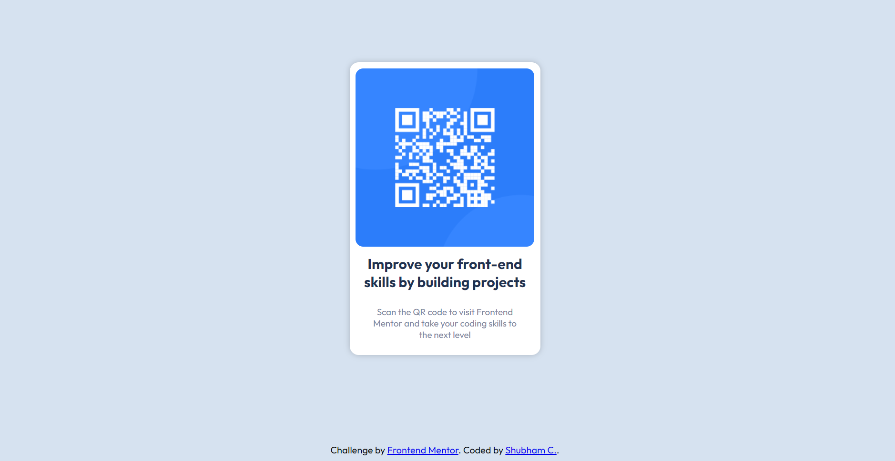

Frontend Mentor - QR code component solution

This is a solution to the [QR code component challenge on Frontend Mentor](https://www.frontendmentor.io/challenges/qr-code-component-iux_sIO_H). Frontend Mentor challenges help you improve your coding skills by building realistic projects. 

## Table of contents

- [Overview](#overview)
  - [Screenshot](#screenshot)
  - [Links](#links)
- [My process](#my-process)
  - [Built with](#built-with)
  - [What I learned](#what-i-learned)
  - [Useful resources](#useful-resources)
- [Author](#author)

## Overview

### Screenshot

### Links

- Solution URL: https://github.com/Hey-Jarvis/QR-code-component-solution
- Live Site URL: https://hey-jarvis.github.io/QR-code-component-solution/

My Process

Built with

- Semantic HTML5 markup
- CSS custom properties
- Flexbox

What I learned

Only practise for flexbox. Its most importatnt point of CSS.

Useful resources

- https://neumorphism.io/#e0e0e0 - This helped me for box shadow. I really liked this pattern and will use it going forward.

Author

- Website - [Shubham C](https://github.com/Hey-Jarvis)
